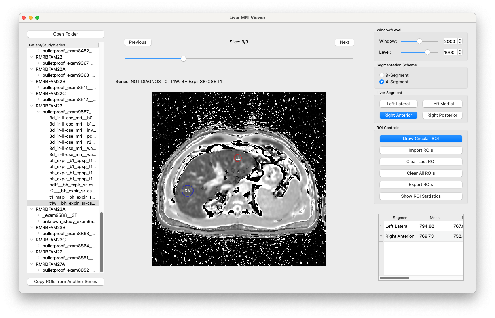

# Liver ROI Tool
A Python application for drawing and exporting ROI statistics, primarily intended for quantitative liver MRI. The application provides tools for visualizing DICOM series, drawing circular ROIs, assigning liver segments, and exporting summary statistics.

## To-Do List
- [x] Open folder, browse DICOM files
- [x] Change window width/level
- [x] Keyboard and mouse shortcuts
- [x] Add and remove ROIs
- [x] Export ROI statistics to CSV
- [x] Switch between 9-segment and 4-segment ROI scheme
- [x] Copy ROIs between series (registered)
- [x] Copy ROIs between series (unregistered)
- [x] Load stored ROIs from a file
- [X] Verify ROI mean / median accuracy (with Horos, MATLAB, etc)
        - Accuracy verified with Horos
- [ ] AI implementation to estimate ROIs

## Features
- DICOM Browser: Navigate patient/study/series hierarchy
- Series Viewer: Display DICOM images with customizable window/level settings
- Image Navigation: Scroll through slices using buttons, keyboard, mouse wheel, or slice slider
- ROI Tools: Draw circular ROIs and associate them with liver segments
- Segmentation Schemes: Switch between 9-segment and 4-segment liver anatomical models
- ROI Statistics: Calculate and display statistics (mean, median, min, max, size) for each ROI
- Export Capabilities: Export ROIs and statistics to CSV files
- ROI Copy: Copy ROIs between series at anatomical positions



## Requirements
- Python 3.6+
- PyQt5
- pydicom
- NumPy

## Installation
1. Clone the repository:
```bash
git clone https://github.com/yourusername/liver-mri-viewer.git
cd liver-mri-viewer
```
2. Install dependencies:
```bash
pip install -r requirements.txt
```

## Usage
1. Run the application:
```bash
python liver-app.py
```
2. Click "Open Folder" to select a directory containing DICOM data
3. Navigate the directory tree and select a series to load
4. Adjust window/level using right-click and drag
5. Draw ROIs by:
- Toggling "Draw Circular ROI" button
- Left-clicking and dragging on the image
- Selecting a liver segment

## Keyboard Shortcuts
- **Ctrl+1 to Ctrl+9**: Select liver segments 1-9
- **Left/Right Arrow or Up/Down Arrow**: Navigate through slices
- **Mouse Wheel**: Scroll through slices

## Project Structure
- liver-app.py: Main application entry point
- dicom_viewer_app.py: Main application class
- dicom_series_model.py: DICOM data management
- dicom_image_renderer.py: Image rendering with window/level
- roi_manager.py: ROI creation and analysis
- series_navigator_panel.py: Series browser UI panel
- image_viewer_panel.py: Image display UI panel
- control_panel.py: Controls for window/level, segments, and ROIs
- statistics_panel.py: ROI statistics display and export

## Extending the Application
The modular architecture makes it easy to extend functionality:
- Add new visualization modes by extending the renderer
- Implement new ROI shapes by modifying the ROI manager
- Add more analysis tools by creating new UI panels

## Disclaimer
This is just a project I made for the purposes of my own research projects. I make no guarantees on the quality of this code since it's just my way of learning PyQt5.